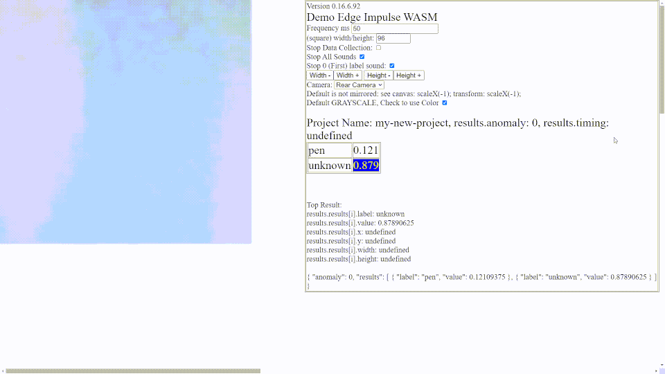

### Vanilla Javascript Lightning Talk Pech Kucha Markdown HTML README.md


##### version 1.1.3-96

Fork this repo, fill in your markdown and <html> for the 15 slides (max 20 slides), record your presentation and save it as ```recorded-talk.m4a``` (or change the code to reflect the new name.)
 
 Setup gitPages --> settings-->pages-->none to master-->save--> copy the link and replace below.

Demo of this Github Markdown can be viewed at this GitPages site (replace this link with your Gitpages link) [https://hpssjellis.github.io/multi-language-edgeimpulse-tutorial-vision-cell-phone/](https://hpssjellis.github.io/multi-language-edgeimpulse-tutorial-vision-cell-phone/)


This Github Repository (replace this link with your Repository Link) [https://github.com/hpssjellis/multi-language-edgeimpulse-tutorial-vision-cell-phone](https://github.com/hpssjellis/multi-language-edgeimpulse-tutorial-vision-cell-phone)


Number of Slides: <input type="text" id="myCountLinks" size="6" value="15" >, Seconds for each Slide: <input type="text" id="myCountMax" size="30" value="20" >   Can be a list of seconds example: 17, 20, 24, 20 The last number continues.
 
 
 To convert to any language click <a href="https://translate.google.com/?sl=en&tl=es&op=websites">here</a><br>
 For example This page in: <a href="https://hpssjellis-github-io.translate.goog/multi-language-edgeimpulse-tutorial-vision-cell-phone/?_x_tr_sl=en&_x_tr_tl=fr&_x_tr_hl=en&_x_tr_pto=wapp">French</a>, <a href="https://hpssjellis-github-io.translate.goog/multi-language-edgeimpulse-tutorial-vision-cell-phone/?_x_tr_sl=en&_x_tr_tl=es&_x_tr_hl=en&_x_tr_pto=wapp">Spanish</a>, Original in <a href="https://hpssjellis.github.io/multi-language-edgeimpulse-tutorial-vision-cell-phone/">English</a>
 
 <input type=button value="Sound by Mr. Ellis in English" onclick="{ 
   document.getElementById('myCountMax').value = '2,5,1,3,1,6,3,20';    
   mySetup();                                             
   myAudio01 = new Audio('recorded-talk.m4a');
   myAudio01.play(); 
   carousel();                                                
}"> 

 
 
<div id="myNumSlides" style=" position:sticky; top:0px; left:20px; height:25px; "> ...</div>  <br>

  


<div id="myStick"  style=" position:sticky; top:30px; display:inline; ">
 
 <input type=button value="Start-No-Sound" onclick="{
   mySetup()
   carousel();  
}">
 
 
 
  <input type=button value="Rewind" onclick="{
   myIndex = 0;  
   clearInterval(myLooper);
   clearInterval(myCounting);
   if (myAudio01.paused && myAudio01.currentTime > 0 && !myAudio01.ended) {
      } else {
         myAudio01.pause();
     }
}">   

 <input type=button value="-" onclick="{
   clearInterval(myLooper);
   clearInterval(myCounting);
   myIndex -= 1;    
   window.location.href='#'+myIndex;
}">   
  
<input type=button value="+" onclick="{
  clearInterval(myLooper);
  clearInterval(myCounting);
  myIndex += 1;  
  window.location.href='#'+myIndex;
}"> 
  
<input type=button value="Back" onclick="{
   myIndex = myIndex - 2;    
   if (myIndex <= 0){myIndex=0};                                      
   myNext();
}">   
  
<input type=button value="Next" onclick="{
   myNext();
}"> 
 
    
  
 <input id="myPause" type=button value="Pause" onclick="{ 
   clearInterval(myLooper);
   clearInterval(myCounting);
   if (this.value == 'Pause'){                                                     
       this.value = 'Play / Pause'; 
       if (myAudio01.paused && myAudio01.currentTime > 0 && !myAudio01.ended) {
      } else {
         myAudio01.pause();
     }
   } else {    
     myIndex -= 1; 
     myCountUp += 1;
     carousel();                                                 
     this.value = 'Pause';  
     if (myAudio01.paused && myAudio01.currentTime > 0 && !myAudio01.ended) {
         myAudio01.play();
      }                                                    
   }
}"> 
 
<input type=button value="Hide" onclick="{
   document.getElementById('myStick').style.display = 'none';
}"> 
  <input type=button value="TOP" onclick="{ 
   window.location.href='#top'; 
}">  
  
 </div>

#### 1

<br><br><br><br><br><br><br><br><br><br><br><br><br><br><br>
<br><br><br><br><br><br><br><br><br><br><br><br><br><br><br>
<hr>


#### 2


Show how to do images and links. Note: To get the url just paste an image right here


[https://github.com/hpssjellis](https://github.com/hpssjellis)

<br><br><br><br><br><br><br><br><br><br><br><br><br><br><br>
<hr>


#### 3


List of photos while making page


 


 

 

 


 


   

 
 

   


 
 
 
 
 
 
 
  

 


 
 
 
 Only do this step if you have an <pre>https</pre>  Web server like a github gitpages setup. Download the WASM zipped file, unzip it and upload it to your HTTPS webserver. 
 


 

 
 Then replace the index.html file with this file that I made which uses the computers webcam  [downloads/index.html](downloads/index.html)
 
 


 
 
 

 
 
 
 

 
 
 
 

 
 
 
 


<br><br><br><br><br><br><br><br><br><br><br><br><br><br><br>
<br><br><br><br><br><br><br><br><br><br><br><br><br><br><br>
<hr>

#### 4

<br><br><br><br><br><br><br><br><br><br><br><br><br><br><br>
<br><br><br><br><br><br><br><br><br><br><br><br><br><br><br>
<hr>

#### 5

<br><br><br><br><br><br><br><br><br><br><br><br><br><br><br>
<br><br><br><br><br><br><br><br><br><br><br><br><br><br><br>
<hr>

#### 6

<br><br><br><br><br><br><br><br><br><br><br><br><br><br><br>
<br><br><br><br><br><br><br><br><br><br><br><br><br><br><br>
<hr>

#### 7

<br><br><br><br><br><br><br><br><br><br><br><br><br><br><br>
<br><br><br><br><br><br><br><br><br><br><br><br><br><br><br>
<hr>

#### 8

<br><br><br><br><br><br><br><br><br><br><br><br><br><br><br>
<br><br><br><br><br><br><br><br><br><br><br><br><br><br><br>
<hr>

#### 9

<br><br><br><br><br><br><br><br><br><br><br><br><br><br><br>
<br><br><br><br><br><br><br><br><br><br><br><br><br><br><br>
<hr>

#### 10

<br><br><br><br><br><br><br><br><br><br><br><br><br><br><br>
<br><br><br><br><br><br><br><br><br><br><br><br><br><br><br>
<hr>

#### 11

<br><br><br><br><br><br><br><br><br><br><br><br><br><br><br>
<br><br><br><br><br><br><br><br><br><br><br><br><br><br><br>
<hr>

#### 12

<br><br><br><br><br><br><br><br><br><br><br><br><br><br><br>
<br><br><br><br><br><br><br><br><br><br><br><br><br><br><br>
<hr>

#### 13

<br><br><br><br><br><br><br><br><br><br><br><br><br><br><br>
<br><br><br><br><br><br><br><br><br><br><br><br><br><br><br>
<hr>

#### 14

<br><br><br><br><br><br><br><br><br><br><br><br><br><br><br>
<br><br><br><br><br><br><br><br><br><br><br><br><br><br><br>
<hr>

#### 15

At 20 seconds per page and 15 slides this would be the end of a 5 min presentation
<br><br><br><br><br><br><br><br><br><br><br><br><br><br><br>
<br><br><br><br><br><br><br><br><br><br><br><br><br><br><br>
<hr>

#### 16

<br><br><br><br><br><br><br><br><br><br><br><br><br><br><br>
<br><br><br><br><br><br><br><br><br><br><br><br><br><br><br>
<hr>

#### 17

<br><br><br><br><br><br><br><br><br><br><br><br><br><br><br>
<br><br><br><br><br><br><br><br><br><br><br><br><br><br><br>
<hr>

#### 18

<br><br><br><br><br><br><br><br><br><br><br><br><br><br><br>
<br><br><br><br><br><br><br><br><br><br><br><br><br><br><br>
<hr>

#### 19

<br><br><br><br><br><br><br><br><br><br><br><br><br><br><br>
<br><br><br><br><br><br><br><br><br><br><br><br><br><br><br>
<hr>

#### 20

<br><br><br><br><br><br><br><br><br><br><br><br><br><br><br>
<br><br><br><br><br><br><br><br><br><br><br><br><br><br><br>
<hr>


<a href="#top">Top of page</a>


### By Jeremy Ellis Twitter @Rocksetta Use at your own Risk!
### Note when looking at the markdown none of the javascript buttons appear, you must go to your Gitpages Demo Link!
A few Javascript abilites do not work, such as hiding the code. So all the Javascript not in buttons is below. 


<script>
 let myIndex = 1;
 let myLooper = 0;
 let myCounting = 0;
 let myMainNum = '2,3,4,5,2,3,4,5';  
 let myMainNumLast = 2;
 let myCountUp = 0;
 let xSlide = 3;
 let myAudio01 = new Audio();
 document.body.style.backgroundColor = "skyblue";
;
 
function mySetup(){
   document.getElementById('myStick').style.display = 'none';                                                 
   xSlide  = document.getElementById('myCountLinks').value; 
   myMainNum = document.getElementById('myCountMax').value.split(','); 
   console.log('myMainNum')
   console.log(myMainNum)
   myAudio01.pause();
   myAudio01.currentTime = 0;  
   myIndex = 0;  
   clearInterval(myLooper);  
   myCountUp = -1;
} 
 
function carousel() {
  clearInterval(myCounting);
  myCountUp = -1;
  var i;
;
  myIndex++;
  if (myIndex > xSlide) {myIndex = xSlide};    
  window.location.href='#'+myIndex;
  myCountDown();
  myCounting = setInterval(myCountDown, 1000);
  if (Number.isInteger( parseInt(myMainNum[myCounting]) ) ) {myMainNumLast = parseInt(myMainNum[myCounting]) }  // check if integer or use last one
  myLooper = setTimeout(carousel, myMainNumLast*1000); 
}
  
function myCountDown(){
  myCountUp++;
  if (myCountUp >= myMainNumLast ) {
    myCountUp = myMainNumLast;                              
  }
  if (myIndex >= xSlide && myMainNumLast == myCountUp){ 
     document.getElementById("myNumSlides").innerHTML = `&nbsp;&nbsp;&nbsp; Slide ${myIndex} of ${xSlide} slides. ALL DONE <input type=button value="Show"  style="height:25px; " onclick="{document.getElementById('myStick').style.display = 'inline'; }"> `;
     clearInterval(myCounting);             
     clearInterval(myLooper);  
  }
  else {    
     document.getElementById("myNumSlides").innerHTML = `&nbsp;&nbsp;&nbsp; Slide ${myIndex} of ${xSlide} slides. ${myMainNumLast-myCountUp} seconds remaining <input type=button value="Show" style="height:25px; " onclick="{document.getElementById('myStick').style.display = 'inline'; }"> `;
  }
}
;
function myNext(){   
  xSlide  = document.getElementById('myCountLinks').value; 
  myMainNum = document.getElementById('myCountMax').value;                        
  clearInterval(myLooper) ; 
  carousel();  
}  
;
</script> 
 

